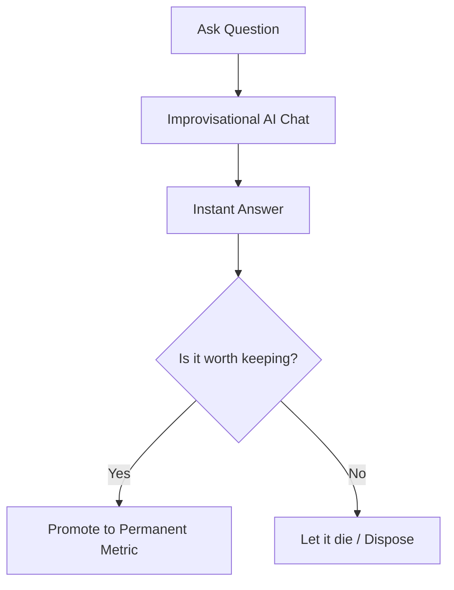

We are wasting six figures a year on dashboard maintenance. In the average data team, 30% to 40% of analyst time is spent fixing broken SQL, adjusting dashboard filters, and maintaining "dashboard graveyards" that nobody looks at after two weeks. 

We need to talk more about **Vibe Analytics**—and how Ravioli was built to serve it.

<!-- truncate -->

## What is Vibe Analytics?

Vibe analytics is conversational data analysis powered by AI. Instead of waiting in ticket queues for pixel-perfect dashboards, you ask questions in plain English, explore data in real time, and only keep the results that are worth turning into permanent artifacts. 

As highlighted in our recent article on [Vibe Analytics](https://jimmypang.substack.com/p/we-need-to-talk-more-about-vibe-analytics), the core philosophy is simple: **Analysis first, artifact second. The default output should be disposable.**

## The Technical Unlock: Why Now?

Historically, Natural Language Query (NLQ) tools failed because they translated text directly into raw SQL. The AI guessed joins, hallucinated metrics, and returned subtly wrong numbers. Trust cratered.

Vibe Analytics in 2026 works because of a critical technical unlock: **The Semantic Layer**. By constraining the AI to pre-defined metrics (like those in dbt MetricFlow or Cube), the query generation is deterministic. The LLM only translates your question into a metric and a dimension; the query engine handles the SQL. 

## Where Ravioli Fits In

To make Vibe Analytics successful, you need two things: **speed** and **modular definitions**. That is exactly why we built **Ravioli**:

1. ⚡ **Local execution speeds at the speed of thought**: Powered by DuckDB, Ravioli queries massive Parquet, CSV, and database files in milliseconds. You can't have a conversational "vibe" if you are waiting 30 seconds for a query to run.
2. 🥞 **Modular, version-controlled definitions**: Ravioli allows you to declare clean schemas and constraints. This clean relational mapping acts as the perfect structural foundation for semantic engines to translate questions without hallucinating joins.
3. 💸 **BI without the BS**: By moving from heavy BI licenses to lightweight, local-first analytics layers, teams compress decision cycles from weeks down to hours while saving €200K+ in maintenance overhead.

## Promoting What Matters

Not everything should be ephemeral. Executive dashboards, regulatory reporting, and core KPIs deserve a permanent home. Everything else should be run, explored, and discarded.

With Ravioli, you get a lightweight data warehouse setup that runs locally, deploys instantly, and gives your analysts the power to build semantic definitions rather than pushing pixels on dashboards.

To get started with Ravioli, check out the [Quick Start Guide](/docs/intro).
