# AI & Notion Integrations

Ravioli integrates closely with external LLM platforms and knowledge base tools to keep your AI grounding, conversational contexts, and analytical documents aligned.

---

## Ollama Client

For privacy-first, 100% local analytics, Ravioli wraps local LLMs using a custom `OllamaClient` wrapper.

### Local vs Cloud Modes
- **Local Mode (Default)**: Connects to a local Ollama node running on your machine (e.g., at `http://localhost:11434` or `host.docker.internal` inside Docker containers). This mode is completely private and requires no internet access.
- **Cloud Mode**: Connects to `https://api.ollama.com` via a secure Bearer API Key, leveraging cloud-hosted models.

### RAM Optimization
LLM models can be large and occupy significant RAM or VRAM. The `OllamaClient` includes a helper method `unload_model()` to explicitly unload models from memory after execution completes by setting the keep-alive option to `0`. This keeps the user's local development environment responsive when not running active analyses.

---

## Notion Integration

Users can sync their internal Knowledge Base with Notion pages.

```mermaid
sequenceDiagram
    participant Notion as Notion API
    participant Sync as NotionSyncService
    participant DB as Postgres DB
    
    rect rgb(30, 41, 59)
    note right of Sync: Import Sync
    Sync->>Notion: Search accessible pages
    Notion-->>Sync: Return page metadata (last_edited_time)
    Sync->>DB: Check cached edit timestamps
    Sync->>Notion: Fetch page block contents
    Notion-->>Sync: Return block tree
    Sync->>DB: Save as KnowledgePage (JSON Blocks)
    end
    
    rect rgb(30, 41, 59)
    note right of Sync: Export Push
    Sync->>DB: Fetch local updates
    Sync->>Notion: Clear remote blocks & append updated block tree
    Notion-->>Sync: Return confirm status
    end
```

### NotionSyncService
The backend uses a `NotionSyncService` wrapper built on the official `notion-client` SDK to synchronize information:
- **Import Sync**: Fetches pages using the Notion Search API, checks the `last_edited_time` tag to identify updates, and parses the page's structural elements (titles, icons, covers) and rich text block tree into Ravioli's compatible JSON database format.
- **Export Push**: Pushes locally generated analyses and knowledge pages back to Notion. Because Notion does not support a full document overwrite API, the service deletes existing blocks on the target page and appends the updated block structures recursively, respecting Notion's limit of 100 blocks per request.

---

## Upcoming Integrations

### Google AI Studio (Gemini)
To expand options for high-context analytical tasks, native support for **Google AI Studio (Gemini API)** is planned. This integration will leverage Gemini's massive 2-million token context window to allow users to attach entire databases, schema directories, and comprehensive multi-hundred-page knowledge manuals to single analyses, bypassing local LLM token limits completely.
