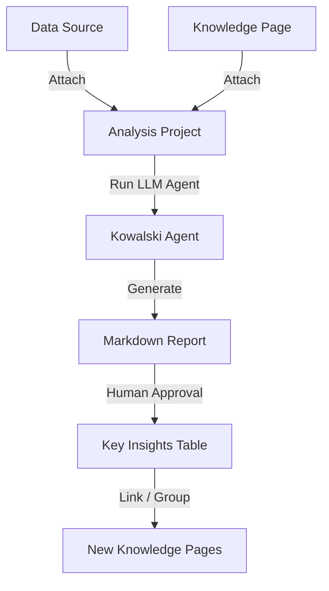

# Analyses & Insights

Ravioli is designed to bridge the gap between heavy data engineering and flexible business analysis. In Ravioli, **Analyses** represent the core entities where raw datasets, domain knowledge, and conversational AI analyst capabilities come together.

## The Anatomy of an Analysis

Every analysis project in Ravioli binds together:
1. **Associated Data Sources**: Specific local tables or ingested files (CSV, Parquet, JSON) in the DuckDB warehouse that the analysis targets.
2. **Contextual Knowledge Pages**: Specific documents from the local Knowledge Base attached to ground the AI in custom domain knowledge, guidelines, or business vocabulary.
3. **The Interactive Notebook**: A chronological execution journal containing prompt queries, thoughts, generated SQL statements, query output tables, and visualizations.
4. **The Analysis Result**: A high-fidelity markdown report synthesizing the key findings of the project.

---

## The AI Analyst: Kowalski

Ravioli's analytical engine is powered by **Kowalski**, an autonomous AI agent. When performing analysis, Kowalski acts as a conversational partner and an active SQL operator.

### Insight Generation & Workflow

1. **Context Preparation**: When a user creates or interacts with an analysis, Ravioli gathers the descriptions of all attached data sources, schema information, and the full content of attached knowledge pages.
2. **Execution Phase**: The agent executes SQL queries directly on the local DuckDB instance, processes the results, and writes thoughts or generates visualizations.
3. **Structured Reporting**: At the end of a deep dive, Kowalski produces a high-level report using predefined templates, detailing:
   - Summary statistics
   - Data quality warnings
   - Key insights
   - Assumptions made
   - Limitations and data constraints

---

## Human-in-the-Loop Validation

To maintain the absolute integrity of the analytical ecosystem, Ravioli implements a **Human-in-the-Loop (HITL)** governance model.

1. **Unverified Status**: When Kowalski generates insights, they are kept in a draft/unverified state within the database.
2. **Approval Action**: Users can review the analysis markdown. Clicking **Approve** triggers a background process that extracts individual key insights, assumptions, and limitations.
3. **Insight Extraction**:
   - Each insight bullet point is parsed and stored as a separate `Insight` entity.
   - The insights are marked with `is_verified = True` and can be published (`is_published = True`) to the wider team.
   - These verified insights can then be synced back to Notion or used to seed new Knowledge Pages.
