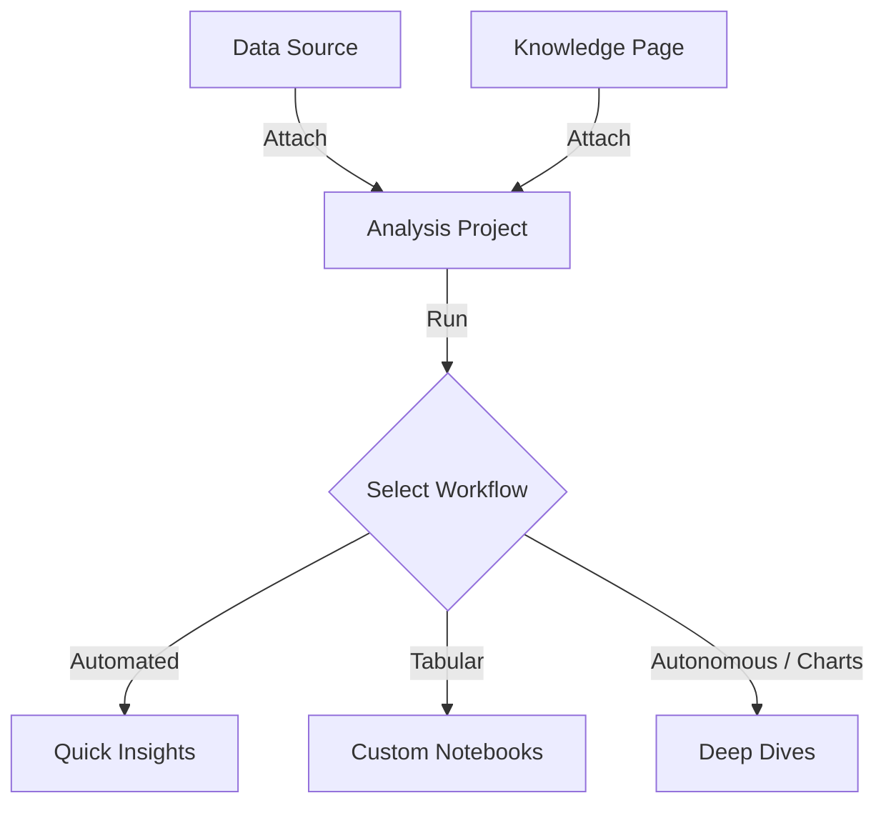

# Analyses

:::info Technical Database Schema
For the transactional database fields and schema structures, refer to the **[`app.analyses` Table Documentation](./data/oltp/analyses.md)** and the **[`app.analysis_logs` Table Documentation](./data/oltp/analysis-logs.md)**.
:::

In Ravioli, **Analyses** are interactive projects designed to explore and query datasets. They represent the primary **[Contributor](./governance/users.md)** activity, enabling users to transform raw data assets into actionable knowledge.

## Triggering an Analysis

An analysis project can be initiated in a few ways:
- **Data Ingestion**: Directly uploading a new dataset (e.g., CSV, Parquet) or connecting to a database.
- **Workspace Navigation**: Selecting an existing data asset and initiating an exploration session.
- **Knowledge Context**: Attaching **Knowledge Pages** to provide domain-specific metadata and instructions to the query runner.

## Exploration Workflows & User Personas

Ravioli adapts to different analytical needs and technical skill levels through three main workflows:

### 1. Quick Insights (Basic Users)
Designed for users who want immediate, hassle-free answers from a single file or data source.
* **Target Persona**: Operations managers, product owners, and business users who need rapid insights without writing queries.
* **Key Features**: Conversational analytics, automated statistical profiling, and instant data quality checks.
* **Learn more**: **[Quick Insights](./analyses/quick-insights.md)**

### 2. Custom Notebooks (Data Analysts & Scientists)
An advanced, cell-based interface that provides precise, granular control over data processing and documentation.
* **Target Persona**: Data analysts, data scientists, and engineers who are highly comfortable writing code and queries.
* **Key Features**: A flexible notebook layout supporting **SQL cells**, **Python cells**, **AI cells**, and **Markdown cells** for complete customization.
* **Learn more**: **[Custom Notebooks](./analyses/custom-notebooks.md)**

### 3. Deep Dives (AI-Guided Analytics) `Upcoming`
An intelligent, automated workflow that bridges the gap between technical and non-technical team members.
* **Target Persona**: Basic users (e.g., ops managers) who want the depth and rigor of advanced data analysis without having to write SQL or Python themselves.
* **Key Features**: AI-generated multi-step analytics plans modeled after Custom Notebook structures. The agent autonomous runs queries, self-corrects on failure, and builds charts to deliver a comprehensive dashboard.
* **Learn more**: **[Deep Dives](./analyses/deep-dives.md)**
