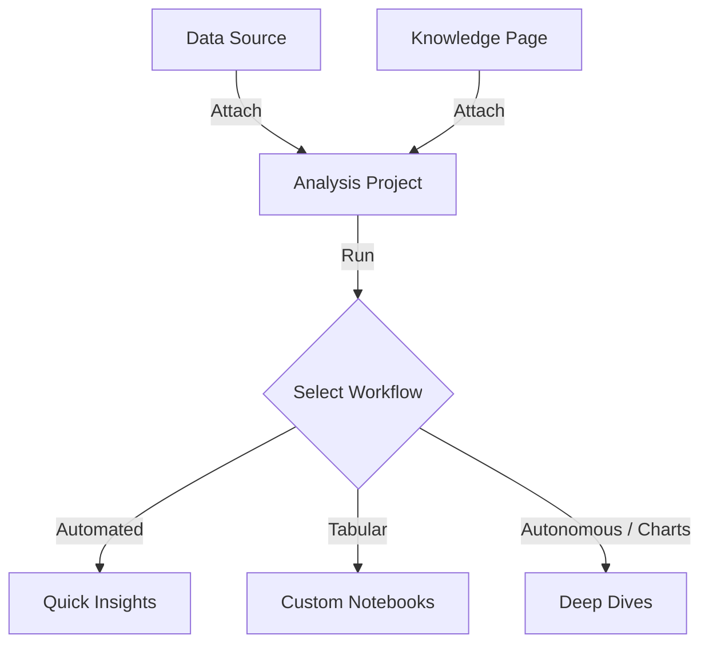

# Analyses

In Ravioli, **Analyses** are interactive projects designed to explore and query datasets. They let you interface with your local DuckDB database through plain English, direct SQL execution, and cell-based notebooks.

## Exploration Workflows

Ravioli offers three distinct workflows to analyze your data assets:

1. **[Quick Insights](./analyses/quick-insights.md)**: Automated statistical profiling and data quality reviews generated immediately upon file uploads.
2. **[Custom Notebooks](./analyses/custom-notebooks.md)**: Cell-based query documents that store execution histories, support live tabular displays, and let you re-run code in-place.
3. **[Deep Dives](./analyses/deep-dives.md)**: AI-driven explorations using autonomous SQL self-correction loops and dynamic charts to answer complex questions.
