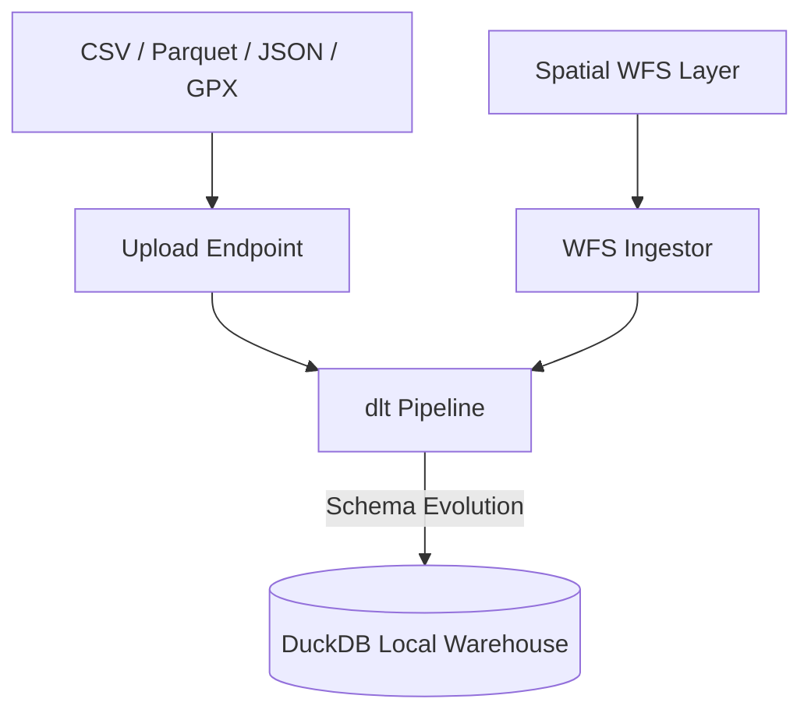

# Data Ingestion

Ravioli features a python-based ingestion subsystem that simplifies loading personal and company datasets. By utilizing the **dlt** (data load tool) library, ingestion processes are robust, self-healing, and handle schema evolution automatically.

---

## Supported Connectors & Formats

### 1. File Uploads
Ravioli supports direct uploads of structured and semi-structured files:
- **CSV / TSV**: Standard tabular data.
- **Parquet**: Highly compressed, columnar files ideal for larger datasets.
- **JSON / JSONL**: Semi-structured event lists or document exports.
- **GPX (GPS Exchange Format)**: Parses running, cycling, and walking outdoor tracks into structured location logs containing latitude, longitude, elevation, and timestamps.

### 2. Personal Data Ingestion (dlt-powered)
Ingestors are provided for major personal data export files:
- **Apple Health**: Ingest fitness workouts, heart rate cycles, and sleep patterns.
- **Spotify**: Load streams, playlist histories, and saved tracks.
- **LinkedIn**: Parse connection lists, message statistics, and profile interactions.
- **Substack**: Import subscriber lists, email open rates, and click-through rates.

### 3. Spatial WFS Ingestor
Users can configure ingestion pipelines for external **Web Feature Service (WFS)** layers. This allows syncing geo-spatial vectors (polygons, lines, points) directly into the DuckDB warehouse for spatial-analytics queries.

---

## The Ingestion Pipeline

Ravioli handles data loads safely by isolating namespaces:

### Schema Isolation
To avoid collisions across different files, data is stored inside distinct database schemas. A pipeline name and dataset name are generated (e.g., `s_spotify`, `s_google_sheet`), keeping the DuckDB catalog clean and modular.

### Progress-Tracked Ingestion
For large uploads, the backend exposes `/api/v1/data/upload/stream` which streams status updates as Server-Sent Events (SSE). The frontend can render a progress bar representing:
1. File validation and hashing.
2. Temporary disk buffering.
3. Execution of the `dlt` pipeline.
4. Final row count verification and indexing in PostgreSQL.
