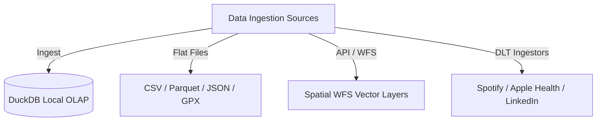

# Data

The **Data** module manages ingestion pipelines, file parsing, and schema isolation in Ravioli's local OLAP database.

---

## Storage: DuckDB OLAP

While operational metadata (user profiles, settings, analysis histories) is stored in PostgreSQL, the analytical core runs entirely in **DuckDB**:
- ** ephemeral Connections**: Connections are opened, queries executed, and closed immediately (`duckdb_manager.connect()`) to release locks and prevent multi-process database collisions.
- **Namespace Isolation**: Datasets are isolated into unique schemas (e.g. `s_google_sheet`) to keep the warehouse organized.

---

## Sub-modules

Explore specific data capabilities:
1. **[Data Ingestion](./data/ingestion.md)**: Details flat file parsing (CSV, Parquet, JSON, GPX), API/WFS integrations, and upcoming DLT connectors.
2. **[Data Transformation](./data/transformation.md)**: Covers the semantic ECL (Extract, Contextualize, Load) by AI philosophy.
