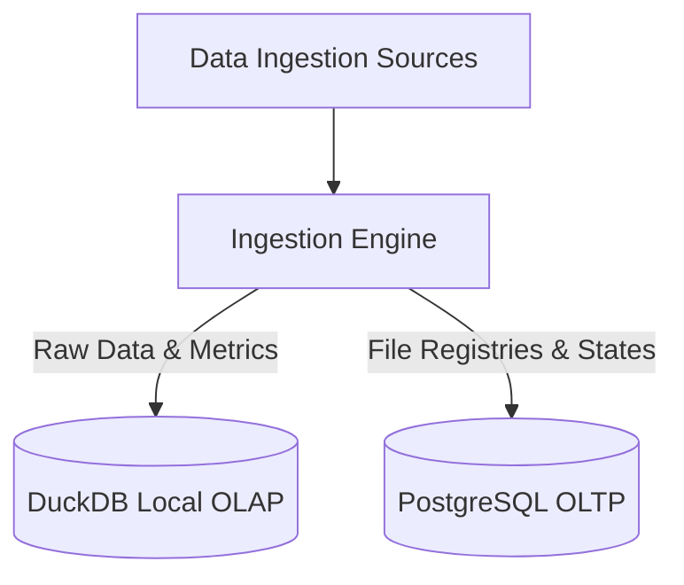

# Data Overview

The **Data** module manages ingestion pipelines, file parsing, workspace metadata registry, and database schemas in Ravioli's hybrid data architecture.

Ravioli splits its storage and execution layer into two primary engines:

---

---

## ⚡ [OLAP Storage (DuckDB)](./data/olap)
The analytical core runs entirely in local **DuckDB** instances:
*   **High-Speed Aggregations**: Optimized columnar processing for massive tabular datasets.
*   **Ingestion Pipeline**: Uploading and parsing Flat Files (CSV, Parquet, JSON, GPX, XML, XLSX) and API layers (WFS, DLT connectors).
*   **Transformation (ECL)**: Contextualizing datasets with business semantics and local Knowledge Base grounding before execution.

## 💾 [OLTP Storage (PostgreSQL)](./data/oltp)
The application workspace and transactional state reside in **PostgreSQL**:
*   **Workspace Management**: Active user directories, user groups, and settings.
*   **Audit Logging**: Step-by-step trace tables detailing LLM agent thought logs and tool executions.
*   **Semantic Metadata**: Lineage mapping for generated insights and registered file details (including PII warning flags).
