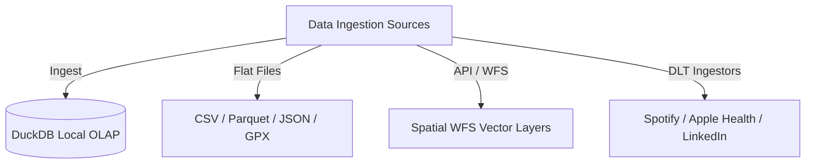

# Data

The **Data** module manages ingestion pipelines, file parsing, and schema isolation in Ravioli's local OLAP database.

---

## Storage: DuckDB OLAP

While operational metadata (user profiles, settings, analysis histories) is stored in PostgreSQL, the analytical core runs entirely in **DuckDB**:
- ** ephemeral Connections**: Connections are opened, queries executed, and closed immediately (`duckdb_manager.connect()`) to release locks and prevent multi-process database collisions.
- **Namespace Isolation**: Datasets are isolated into unique schemas (e.g. `s_google_sheet`) to keep the warehouse organized.

---

## Ingestion Sub-modules

Explore specific ingestion capabilities:
1. **[Flat Files](./data/flat-files.md)**: Upload and validation pipelines for tabular CSV, Parquet, JSON, and GPS GPX files.
2. **[API Ingestion](./data/api.md)**: Ingesting Web Feature Service (WFS) geometry layers.
3. **[DLT Ingestion](./data/dlt-ingestion.md)** *(Upcoming)*: Dedicated pipelines for Spotify, Apple Health, LinkedIn, and Substack exports.
