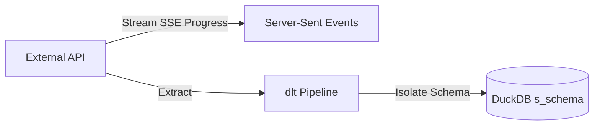

# API Ingestion

Ravioli integrates with external web services and APIs to fetch remote, dynamic, or streaming datasets directly into the local OLAP database.

---

## Web Feature Service (WFS) Client

For spatial and geographic datasets, Ravioli implements a standard **WFS 2.0.0 Client** to query remote GIS databases.

### Key Capabilities
*   **GetCapabilities Parsing**: Queries the WFS service endpoint to parse XML capabilities documents and catalog available feature types (layers) dynamically.
*   **Paging/Chunking**: Implements server-side paging using `count` and `startIndex` parameters to safely stream massive geospatial layers in manageable batches.
*   **Format Auto-Fallback**: Attempts to fetch features in standard `application/json` format. If the remote service fails or does not support JSON, the client falls back to requesting `csv` format and transforms the stream transparently.
*   **Relational Flattening**: Automatically flattens complex nested spatial geometry properties into relational fields inside DuckDB tables.

---

## Roadmap: DLT-Powered Connectors

Ravioli is expanding its data ingestion pipeline to support schema-evolution-resilient APIs using **dlt (data load tool)** pipelines. 

### Planned Personal Data Sources

*   **Apple Health**: Workouts, active energy, heart rate, and step logs.
*   **Spotify**: Stream histories, artist details, and track/playlist catalogs.
*   **LinkedIn**: Inboxes, connection growth stats, and profile views.
*   **Substack**: Newsletter subscriber growth lists, open rates, and click metrics.

### Orchestration Architecture
*   **Namespace Isolation**: To avoid namespace conflicts, each API connector writes directly to an isolated database schema (e.g. `s_spotify`, `s_apple_health`).
*   **Progress Streaming**: Long-running extractions report execution steps dynamically back to the client interface using **Server-Sent Events (SSE)**.
