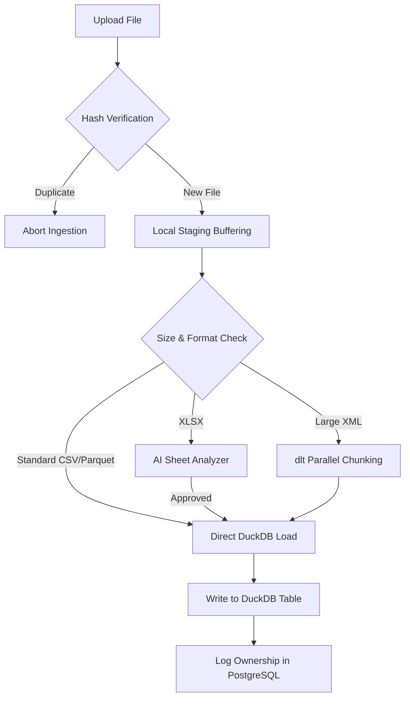

# Flat Files Ingestion

Ravioli features a high-performance, resilient flat file ingestion pipeline designed to process tabular and semi-structured file formats. Under the hood, it combines the speed of **DuckDB** with the validation capabilities of **dlt (data load tool)** and AI-driven structure validation.

---

## Supported File Formats

Ravioli supports a variety of standard datasets:

*   **CSV / TSV**: Standard tabular files loaded directly using DuckDB's optimized `read_csv_auto` parser.
*   **Parquet**: Columnar format optimized for high-speed OLAP queries and metadata-level compression.
*   **JSON / JSONL**: Semi-structured document and event stream logs.
*   **XML**: Structured XML documents, supported via configuration-driven extraction strategies.
*   **GPX (GPS Exchange Format)**: Location logs from athletic runs, walks, or cycling tracks.
*   **XLSX (Excel)**: Complex multi-sheet spreadsheets validated via AI-assisted structures.

---

## Ingestion Pipelines & Strategies

Depending on file type and file size, Ravioli selects the optimal ingestion strategy.

### 1. Standard vs. Chunking Mode
Ravioli uses a size threshold (default **1 GB**) to toggle between modes:
*   **Standard Mode**: For files under the threshold, data is loaded into memory or processed via standard single-pass reads for fast execution.
*   **Chunking (Streaming) Mode**: For very large files, chunked streaming is activated automatically to prevent memory spikes. For example, large XML parsing is partitioned and processed across multiple parallel workers.

### 2. Config-Driven XML Ingestion
XML parsing uses predefined schema strategies matched against file names.
*   **Parallelization**: Large XML files are divided into worker chunks, and processed in parallel with a `dlt` pipeline.
*   **Resource Mapping**: Individual nodes and metadata tags can be mapped to dedicated database tables dynamically.

### 3. AI-Assisted Excel (XLSX) Parsing
Multi-sheet Excel files often present non-standard grid structures. To handle this:
1.  **AI Structure Analysis**: The ingestion engine passes a small preview (the first 20 rows) of each sheet to the AI agent to inspect layout patterns (e.g. identify headers, detect empty rows, find table starts).
2.  **Validation Verdict**: The sheet structure is either accepted (`ready`) or skipped (`reject`) based on the structure layout.
3.  **Data Extraction**: The system dynamically shapes the pandas dataframe using the AI's structural instructions before loading it into DuckDB.

### 4. GPX Track parsing
GPX spatial tracks are parsed sequentially using `xml.etree.ElementTree.iterparse` to stream:
*   `latitude` and `longitude`
*   `time`
*   `elevation`

---

## Verification & Storage Flow

