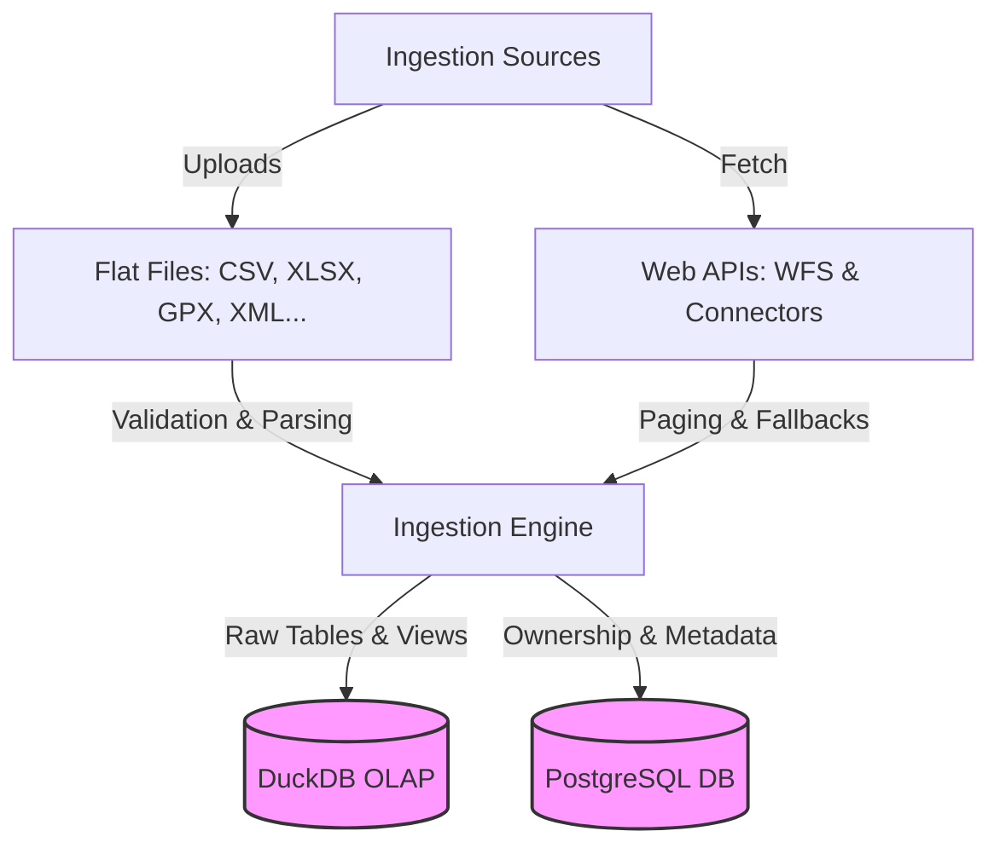
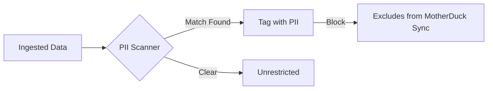

# Data Ingestion Overview

The **Data Ingestion** module is responsible for importing external datasets, querying APIs, and loading raw data safely into Ravioli's OLAP database (DuckDB) and transactional database (PostgreSQL).

Ravioli splits data ingestion into two primary strategies:

---

## Ingestion Categories

### 📄 [Flat Files Ingestion](./flat-files)
Learn how Ravioli processes and validates uploaded spreadsheets and files:
*   **Supported Formats**: CSV, TSV, Parquet, JSON, GPX, XML, and XLSX (Excel).
*   **AI Sheet Analysis**: Uses LLM agents to detect structures and validate spreadsheet structures before loading them.
*   **Parallel Streaming**: Splitting large XML files into chunks for concurrent loading using `dlt`.

### 🌐 [API Ingestion](./api)
Learn how Ravioli connects to online APIs and geospatial layers:
*   **WFS Integration**: Pulls geo-features and geometries from Web Feature Services.
*   **Personal Data Connectors**: Connects to Apple Health, Spotify, LinkedIn, and Substack (planned).
*   **Namespace Isolation**: Keeps incoming schemas isolated to prevent database catalog pollution.

---

## Core Ingestion Flow

1.  **Duplicate Detection**: Hashing files to prevent reloading identical data.
2.  **Staging Buffer**: Writing raw uploads to temporary storage.
3.  **Parsing & Mapping**: Running specialized parsers or AI helpers.
4.  **Database Storage**: Creating schemas and storing tables in DuckDB while logging dataset ownership and metadata in PostgreSQL.

---

## PII Detection & Privacy Protection

To safeguard sensitive user data, Ravioli integrates a rule-based **PII (Personally Identifiable Information) Scanner** directly into the ingestion pipeline.

### 1. Ingestion Scanning
Every tabular dataset is sampled during ingestion. The engine checks column contents against standard patterns to detect:
*   **Emails**: standard email address patterns.
*   **Phone Numbers**: multi-format international telephone numbers.
*   **Credit Cards**: 13 to 16 digit card sequences.
*   **Social Security Numbers (SSN)**: standard SSN patterns.
*   **IP Addresses**: IPv4 addresses.

### 2. Privacy Constraints & Sync Policies
If any matching pattern is found in the sample:
*   **PII Tagging**: The dataset is tagged as `has_pii = True` in PostgreSQL and flagged with a `PII` warning badge in the user interface.
*   **Cloud Block**: PII-tagged data sources are **restricted to Local storage only**. They are automatically ignored and filtered out of any cloud synchronization or MotherDuck bulk push operations.
*   **Override & Dismissal**: If a detection is verified as a false positive, users can manually dismiss the tag inside the frontend interface, which updates the flag to `False` and restores sync capabilities.
