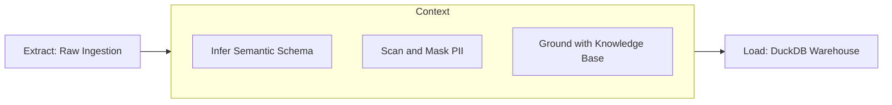
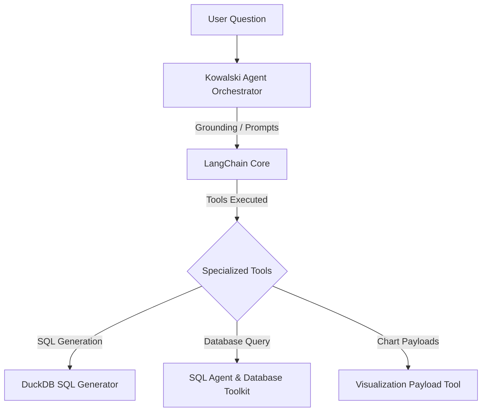

# Data Transformation (ECL)

Ravioli redefines traditional ETL (Extract, Transform, Load) pipelines for the AI era with **ECL: Extract, Contextualize, Load**. By embedding AI context directly into the transformation layer, data assets are enriched with semantic understanding during ingestion.

---

## The ECL Philosophy

### 1. Extract
Ravioli extracts raw data from local files, external Web Feature Service (WFS) endpoints, or personal connectors. The extraction layer handles basic validation, duplicate checking via hashing, and buffers the raw rows safely.

### 2. Contextualize (by AI)
Unlike traditional transformations that only filter or aggregate, Ravioli contextualizes data using LLMs:
- **Semantic Schema Mapping**: Instead of raw column names, the AI maps fields to business vocabulary (e.g., matching a column `ts_stream` to the concept of "User Engagement Time").
- **PII Scanning**: Automatically detects sensitive personally identifiable information (PII) like phone numbers, names, or addresses, allowing users to mask them before database loading.
- **Knowledge Base Grounding**: Enriches records by linking them to specific definitions or business rules defined in the local Knowledge Base.
- **Anomalies and Skewness**: Flags data outliers and anomalies, generating natural language explanations.

### 3. Load
The fully contextualized data, schemas, and semantic metadata are loaded into:
- **DuckDB**: Fast, local OLAP storage for execution queries.
- **PostgreSQL**: Stores the metadata registry, audit tags, and user attribution lineage.

---

## LangChain & AI Tool Execution

Ravioli integrates **LangChain** core components and agent toolkits to orchestrate the contextualization and execution layers. This allows the system to bridge the gap between raw database storage and natural language interface tools.

### 1. Contextualization & Grounding
During processing, LangChain `PromptTemplate` and output parsers are used to shape the inputs and outputs of local models (e.g., Ollama's `qwen2.5` or `gemma3`). The inputs are grounded by fetching schemas dynamically from the database using SQL metadata tables (`duckdb_tables`).

### 2. SQL Generation Tool
Ravioli features a dedicated **SQL Generator** that translates user questions into highly optimized DuckDB SQL queries. 
*   **Schema Retrieval**: Dynamically fetches column structures using `DESCRIBE` metadata.
*   **DuckDB Optimization**: The model is prompted with DuckDB-specific SQL syntaxes.
*   **Code Cleaning**: Post-processing regular expressions clean and extract executable queries out of raw LLM markdown blocks.

### 3. SQL Database Agent
For complex multi-step reasoning, Ravioli configures a LangChain database agent utilizing `create_sql_agent` and `SQLDatabaseToolkit`:
*   **Search Path Routing**: Routes searches through database schemas automatically (`marts`, `s_spotify`, etc.).
*   **Mart Priority Rule**: The agent prioritizes query execution on clean, curated tables in the `marts` schema before searching raw landing schemas (`s_*`).
*   **Source Attribution**: When querying raw tables, the agent recognizes schema prefixes (e.g. `s_linkedin`) to attribute the data source back to the user interface.

### 4. Visualization Tool
The **Visualization Payload Tool** executes generated queries, evaluates the resulting Pandas dataframe columns, and builds chart configurations (supporting `bar`, `line`, `pie`, or `scatter` charts) matching a Pydantic-defined schema (`VizStrategy`). This configures ready-to-render Chart.js options dynamically for the frontend.
