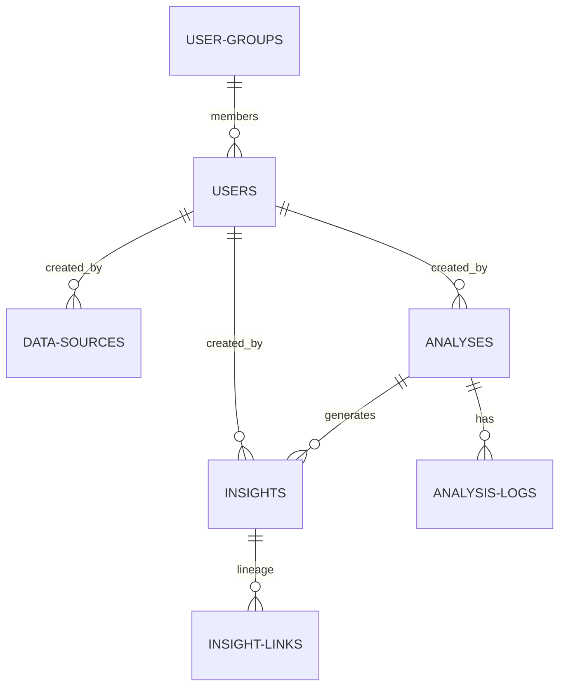

# OLTP Storage (PostgreSQL)

Ravioli uses **PostgreSQL** as its transactional (OLTP) database engine. While DuckDB holds the heavy analytical data points, PostgreSQL acts as the operational brain, storing application states, workspace setups, user authentication, and audit logs.

Operational tables are organized under the **`app`** database schema.

---

## PostgreSQL Database Schema (`app`)

The operational schema manages entity relationships for workspace permissions, audit trails, and agent execution tracking.

### Table Registry Overview

Ravioli organizes its transactional tables as follows:

| Table Name | Description | Focus Area |
| :--- | :--- | :--- |
| **[`app.users`](./oltp/users.md)** | Stores user credentials, contact metadata, system roles (`Admin`, `Steward`, etc.), and active state. | Identity & Auth |
| **[`app.user_groups`](./oltp/user-groups.md)** | Defines organizational spaces or team workspaces. | Identity & Auth |
| **[`app.user_group_members`](./oltp/user-group-members.md)** | Maps user membership status and roles within specific groups. | Identity & Auth |
| **[`app.data_sources`](./oltp/data-sources.md)** | Registry of all uploaded files/APIs, hashes, row counts, status, and PII markers. | Ingestion Registry |
| **[`app.analyses`](./oltp/analyses.md)** | Tracks workspace goals, notebook configurations (`.ipynb`), statuses, and outcomes. | Agent Execution |
| **[`app.analysis_logs`](./oltp/analysis-logs.md)** | Logs granular agent execution steps (thoughts, tool runs, observations, and exceptions). | Agent Execution |
| **[`app.insights`](./oltp/insights.md)** | Distills approved analysis reports into verified, granular bullet-point facts. | Insights & Lineage |
| **[`app.insight_links`](./oltp/insight-links.md)** | Maps self-referential parent-child relationships to construct derived insight lineages. | Insights & Lineage |
| **[`app.knowledge_pages`](./oltp/knowledge-pages.md)** | Notion-compatible pages structured as block lists for local AI prompting context. | Knowledge Base |
| **[`app.system_settings`](./oltp/system-settings.md)** | Config key-value registry (holds credentials, tokens, and model setups). | System Config |

---

## Storage & Setup

For operational databases, PostgreSQL supports:
*   **Foreign Keys**: Enforces constraints between ownership and attribution tags.
*   **Encrypted Payloads**: Secures tokens and credentials inside system settings.
*   **Lineage Relationships**: Maps self-referencing many-to-many DAG lines for insights.
