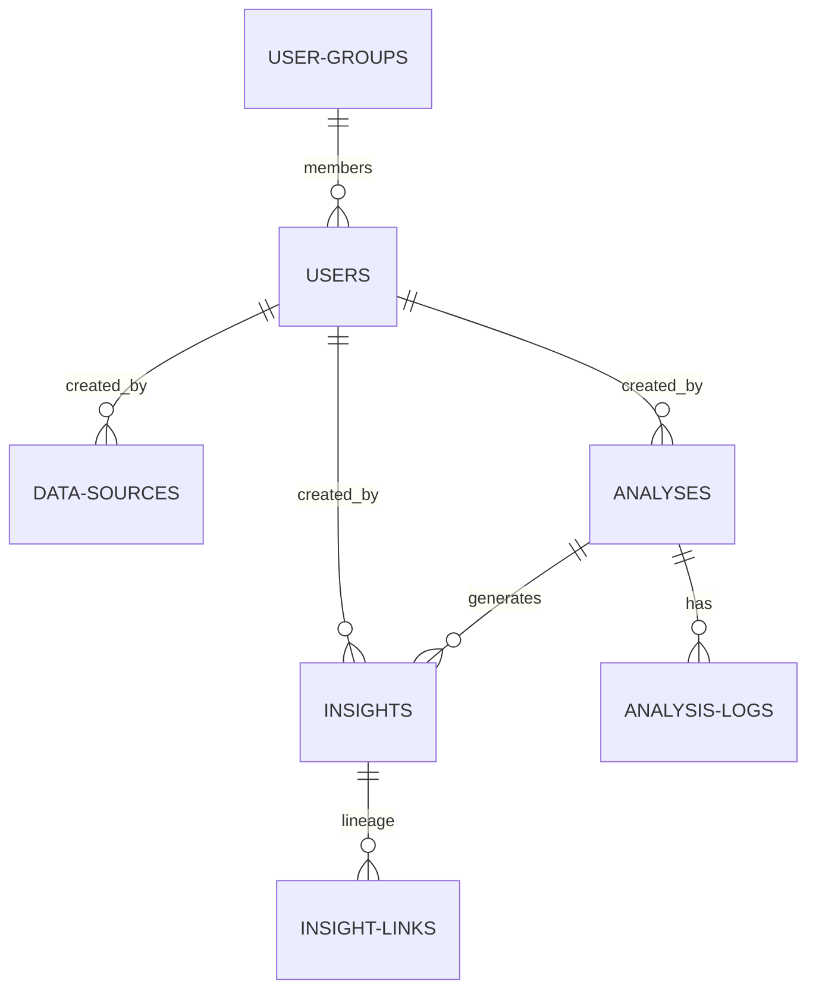

# OLTP Storage (PostgreSQL)

Ravioli uses **PostgreSQL** as its transactional (OLTP) database engine. While DuckDB holds the heavy analytical data points, PostgreSQL acts as the operational brain, storing application states, workspace setups, user authentication, and audit logs.

Operational tables are organized under the **`app`** database schema.

---

## PostgreSQL Database Schema (`app`)

The operational schema manages entity relationships for workspace permissions, audit trails, and agent execution tracking.

### 1. User & Workspace Management
*   **`app.users`**: Stores user credentials, active statuses, emails, and system roles (`Admin`, `Steward`, `Contributor`, `Viewer`).
*   **`app.user_groups`** & **`app.user_group_members`**: Tracks collaboration spaces, grouping users into organizational units with specific group-level permissions.

### 2. Ingestion Registry & Data Sources
*   **`app.data_sources`**: The central registry tracking all active, pending, or failed raw ingestion files.
    *   Logs filenames, sizes, hashes, and schemas.
    *   Tracks source URL, type (`file`, `wfs`), and the **PII flag** status (`has_pii`).

### 3. Agent Execution & Task Tracking
*   **`app.analyses`**: Stores goals, parameters, notebooks (as `.ipynb` json objects), status flags (`pending`, `running`, `completed`, `failed`), and final generated outcomes.
*   **`app.analysis_logs`**: Holds step-by-step logs of LLM agent thoughts, tool usages, observations, and runtime errors to provide complete transparency.

### 4. Insight Generation & Lineage
*   **`app.insights`**: Distills analytical outcomes into granular, individual bullet-point observations. Tracks publication states, steward verifications, and user attributions.
*   **`app.insight_links`**: Traces the self-referential lineage of derived insights, tracking which parent insights contributed to forming a child insight.

### 5. System Config
*   **`app.system_settings`**: Key-value stores tracking workspace configurations (e.g., encrypted LLM keys or MotherDuck cloud credentials).
