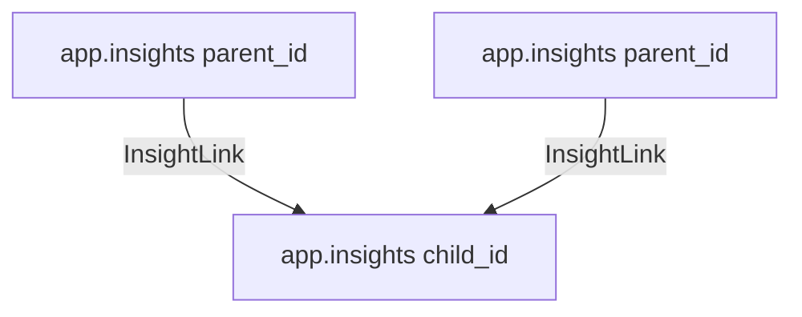

# `app.insight_links`

The `app.insight_links` table maps self-referential lineage relationships between insights, showing how raw discoveries lead to tactical decisions.

---

## Schema Field Definition

| Field Name | Type | Description |
| :--- | :--- | :--- |
| `parent_id` | `UUID` (Composite Primary Key, Foreign Key) | References the upstream originating insight (`app.insights.id`). |
| `child_id` | `UUID` (Composite Primary Key, Foreign Key) | References the downstream derived insight (`app.insights.id`). |

---

## Directed Acyclic Graph (DAG) Lineage

This table stores composite relationships as a Directed Acyclic Graph (DAG):

By querying `insight_links`, Ravioli can render lineage paths showing the logical thread from raw data ingestion observations up to verified business decisions.
