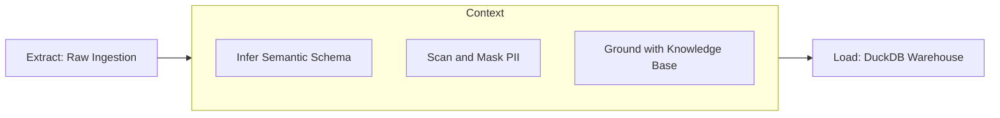

# Data Transformation (ECL)

Ravioli redefines traditional ETL (Extract, Transform, Load) pipelines for the AI era with **ECL: Extract, Contextualize, Load**. By embedding AI context directly into the transformation layer, data assets are enriched with semantic understanding during ingestion.

---

## The ECL Philosophy

### 1. Extract
Ravioli extracts raw data from local files, external Web Feature Service (WFS) endpoints, or personal connectors. The extraction layer handles basic validation, duplicate checking via hashing, and buffers the raw rows safely.

### 2. Contextualize (by AI)
Unlike traditional transformations that only filter or aggregate, Ravioli contextualizes data using LLMs:
- **Semantic Schema Mapping**: Instead of raw column names, the AI maps fields to business vocabulary (e.g., matching a column `ts_stream` to the concept of "User Engagement Time").
- **PII Scanning**: Automatically detects sensitive personally identifiable information (PII) like phone numbers, names, or addresses, allowing users to mask them before database loading.
- **Knowledge Base Grounding**: Enriches records by linking them to specific definitions or business rules defined in the local Knowledge Base.
- **Anomalies and Skewness**: Flags data outliers and anomalies, generating natural language explanations.

### 3. Load
The fully contextualized data, schemas, and semantic metadata are loaded into:
- **DuckDB**: Fast, local OLAP storage for execution queries.
- **PostgreSQL**: Stores the metadata registry, audit tags, and user attribution lineage.
