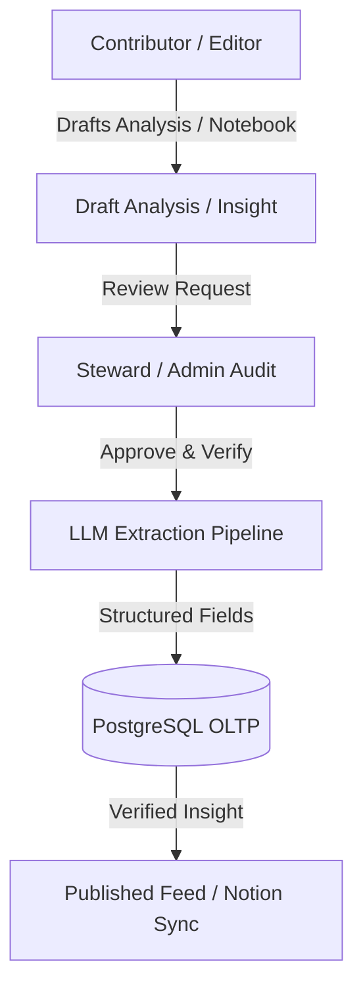

# Governance Overview

Ravioli implements a decentralized, role-based data governance model that ensures all team intelligence is accurate, auditable, and traceably verified before sharing. 

By separating the generation of draft analytical findings from their official verification, Ravioli protects decision-making processes from unvetted AI hallucinations or incorrect manual assertions.

---

---

## Core Pillars of Governance

Explore the primary mechanisms driving data governance in Ravioli:

### 👤 [User Roles & Permissions](./governance/users.md)
Ravioli uses a structured Role-Based Access Control (RBAC) model. Understand the distinct capabilities of the four platform roles:
*   **Admin**: System-wide configuration, user provisioning, and full override capabilities.
*   **Steward**: Subject matter experts responsible for validating analytical results and verifying insights.
*   **Contributor**: Data analysts and developers authoring notebooks and running queries.
*   **Viewer**: Business stakeholders consuming published reports and feeds.

### 👥 [Collaborative Groups](./governance/groups.md)
Manage shared permissions and assets collectively instead of individually.
*   **Collective Ownership**: Assign analyses, data sources, and knowledge blocks to a group.
*   **Decentralized Auditing**: Allow any steward member of a group to verify drafts generated on behalf of that group.

### 🔍 [Insights Review & Verification](./governance/insights-review.md)
The gateway for publishing findings to the team directory and syncing to Notion.
*   **Separation of Duties**: Ensures creators cannot self-approve their work.
*   **LLM Extraction**: Explains how unstructured markdown analyses are transformed into structured key-value database insights.
