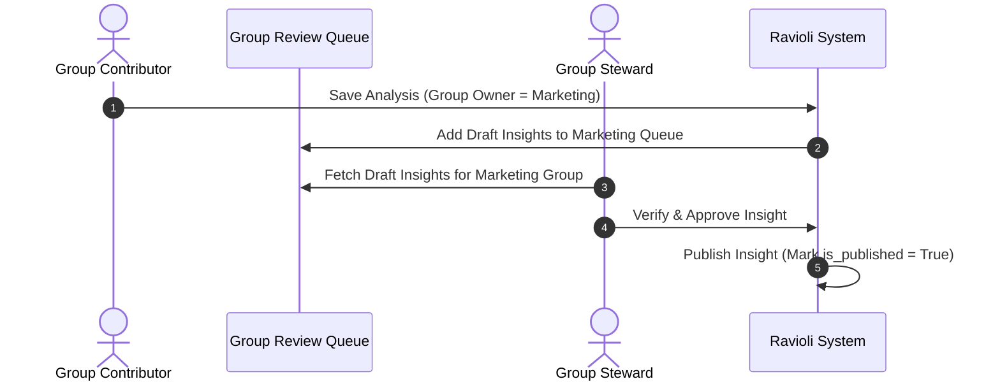

# Groups

:::info Technical Database Schema
For the transactional database fields and schema structures, refer to the **[`app.user_groups` Table Documentation](../data/oltp/user-groups.md)** and the **[`app.user_group_members` Table Documentation](../data/oltp/user-group-members.md)**.
:::

To support collaborative and decentralized team management, Ravioli features **User Groups**. Groups act as collective owners of data assets, analyses, and knowledge entries, enabling functional boundaries and decentralized stewardship.

---

## Collective Ownership

When raw files, notebooks, or analyses are created, ownership can be assigned to a team group (e.g., "Finance Analytics", "Marketing Ops") rather than a single individual:
- **Shared Access**: All members of a group inherit permissions to view, run, and update the group's assets.
- **`owner_type = 'group'`**: Identifies that a collective entity owns the resource, switching access controls from individual checks to group membership lookups.

:::warning Resilience against Asset Orphanage
In many data platforms, assets like custom SQL notebooks, registered data sources, and business knowledge pages are tied to individual user accounts. When a team member departs the company or changes teams, these assets often become "orphaned" and inaccessible, leading to dead links and lost institutional knowledge.

Ravioli's group-based ownership solves this struggle. By default, assigning assets to a User Group ensures that ownership is bound to the team context rather than the individual. The assets remain fully active and maintainable by the remaining group members, creating a much more resilient data architecture.
:::

### Database & API Access Verification
When a user attempts to retrieve, modify, or run a query against a protected asset:
1. The backend inspects the asset's `owner_type`.
2. If `owner_type` is `'user'`, access is verified by checking if `owner_id` matches the active user's ID (or if the user is an `Admin`).
3. If `owner_type` is `'group'`, the backend performs a join query on the `app.user_group_members` mapping table:
   ```sql
   SELECT 1 FROM app.user_group_members 
   WHERE group_id = :owner_id AND user_id = :current_user_id
   ```
4. If a matching record is returned, the user is authorized to interact with the group-owned asset.

---

## Decentralized Group Review Queues

By assigning analyses and insights to groups, Ravioli enables decentralized stewardship. Contributors submit draft insights within their group namespace, and any Steward associated with that group can verify them.



---

## Common Group Use Cases

To maintain clean data boundaries, organizations generally structure their Ravioli groups around business capabilities:

| Group Name | Typical Members | Governance Objective |
| :--- | :--- | :--- |
| **Finance Team** | Financial Analysts, CFO, Stewards | Protect sensitive revenue and expense datasets. Ensure all reports are verified by a Finance Steward before presenting. |
| **Marketing Ops** | Campaign Managers, Marketing Analysts, CMO | Collaborate on campaign performance metrics. Enable quick iteration on Google Analytics and Ad spend data. |
| **Operations Team** | Ops Managers, Supply Chain Analysts, Logistics Stewards | Monitor fulfillment metrics, warehouse yields, and delivery datasets. Allow local Ops Stewards to verify operational insights. |
| **Core Platform** | Analytics Engineers, Admins | Manage system-wide transformations, oversee raw warehouse ingests, and maintain Docusaurus/Notion sync keys. |

---

## Group Management

- **Membership mapping**: Managed via the secondary link table `app.user_group_members`, facilitating simple join queries.
- **Group Metadata**: Groups themselves have an `owner_id` (the user who created the group) and auditing tags (`created_by`, `updated_by`) to ensure administrative accountability.
- **Steward Association**: Stewards can be added to multiple groups to act as cross-functional verifiers, ensuring operational reports always undergo peer-review.
