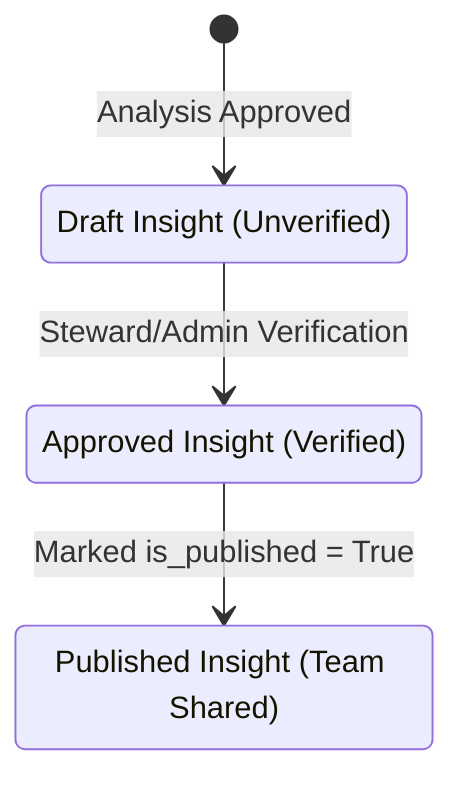

# Insights

**Insights** represent audited and verified facts extracted from your data analyses. Rather than sharing raw, unverified reports, Ravioli enforces a formal review lifecycle to maintain the integrity of shared intelligence.

---

## The Lifecycle of an Insight

When an analysis is completed, the resulting conclusions undergo a governance workflow:

### 1. Verification
When an Admin or Steward reviews a draft analysis report, clicking **Approve** triggers a background extraction task (`extract_and_store_insights`). The LLM parses the report into distinct key insight bullets, assumptions, and limitations.

### 2. Lineage and Relations
Each insight is saved in the `app.insights` table and carries metadata showing:
- Which analysis it originated from.
- Who created and approved it.
- **Insight Links**: Relations (`InsightLink`) showing how insights connect (e.g. supporting or contradicting other team insights).

### 3. Publishing and Notion Sync
Once verified, insights are flagged as `is_verified = true`. Users can toggle `is_published = true` to publish them to team dashboards or export them to external Notion workspaces.
