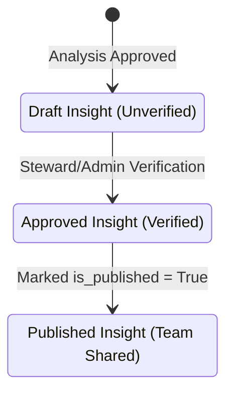

# Insights

:::info Technical Database Schema
For the transactional database fields and schema structures, refer to the **[`app.insights` Table Documentation](./data/oltp/insights.md)** and the **[`app.insight_links` Table Documentation](./data/oltp/insight-links.md)**.
:::

**Insights** represent audited and verified facts extracted from your data analyses. In Ravioli, insights are the primary structured outputs generated from **[Analyses](./analyses.md)**. Rather than sharing raw, unverified reports, Ravioli enforces a formal review lifecycle to extract verified facts and maintain the integrity of shared intelligence.

---

## Insights Review Lifecycle

Ravioli ensures the quality and accuracy of shared intelligence by routing findings through a governance workflow:

1. **Draft State (Unverified)**: Created automatically when an analysis is approved, or manually drafted by an **[Editor](./governance/users.md#role-based-governance)**. The draft inherits its **ownership** (either individual or **[User Group](./governance/groups.md)**) from the parent analysis.
2. **Verification**: Reviewed, audited, and approved exclusively by an authorized **[Steward](./governance/users.md#role-based-governance)** or **[Admin](./governance/users.md#role-based-governance)**. This step links the verifier's identity to the insight metadata to maintain strict accountability. Learn more about [Ownership & Approval Attribution](./governance/insights-review.md#insight-ownership--approval-attribution).
3. **Publishing**: Once verified, the insight is marked as `is_published = True` and displayed on team feeds, dashboard aggregates, and synced to third-party tools like Notion.

---

## Outcomes of Analyses

Insights are the structured results of your completed **[Analyses](./analyses.md)**. When a report is approved by an Admin or Steward, the backend runs a background task to extract individual bullet points, log audit lineages, and create dependencies.

Explore the modules:
1. **[Feed & Summary](./insights/feed-summary.md)**: Review published insights feed logs and high-level platform statistics.
2. **[Lineage Map](./insights/lineage-map.md)**: Explore the directed graph of insight dependencies showing how facts lead to business actions.
