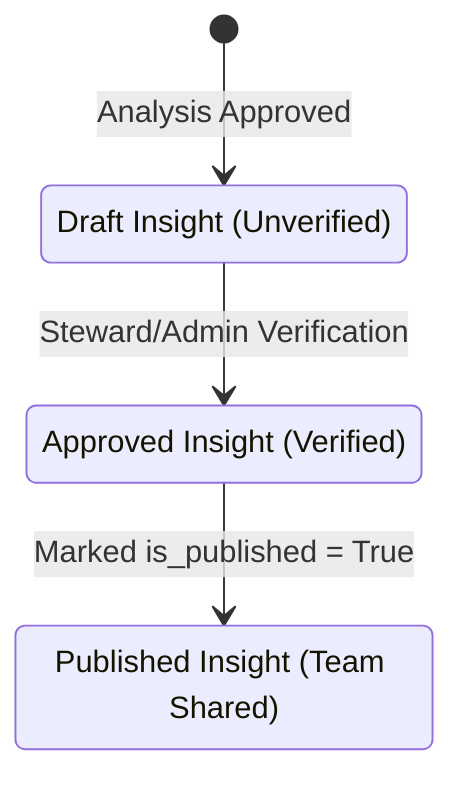

# Insights

**Insights** represent audited and verified facts extracted from your data analyses. Rather than sharing raw, unverified reports, Ravioli enforces a formal review lifecycle to extract verified facts and maintain the integrity of shared intelligence.

---

## Outcomes of Analyses

Insights are the structured results of your completed **[Analyses](./analyses.md)**. When a report is approved by an Admin or Steward, the backend runs a background task to extract individual bullet points, log audit lineages, and create dependencies.

Explore the modules:
1. **[Feed & Summary](./insights/feed-summary.md)**: Review published insights feed logs and high-level platform statistics.
2. **[Lineage Map](./insights/lineage-map.md)**: Explore the directed graph of insight dependencies showing how facts lead to business actions.
