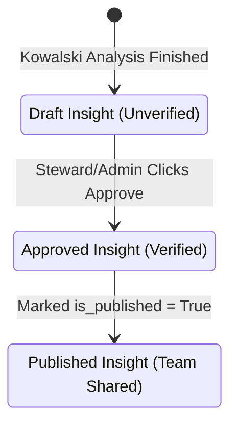

# Insights

**Insights** represent verified business facts extracted from data. Ravioli differentiates between automated statistical profiles (**Quick Insights**) and audited team-wide conclusions.

---

## Quick Insights

Quick Insights are generated immediately upon data ingestion to provide a baseline statistical and quality overview of new datasets.

### Profiling Flow
1. **Type Preprocessing**: Ravioli cleans and casts incoming dataframes, categorizing ID columns as strings or low-cardinality categories to prevent calculations like "average postal code".
2. **ydata-profiling Engine**: Runs a lightweight statistical report to collect skewness, null counts, constant columns, correlations, and sample rows.
3. **LLM Synthesis**: Summarizes the profile into a clean markdown document highlighting key numbers (wrapped in backticks for visibility), grounding assumptions, and dataset limitations.
4. **Follow-Up Prompts**: Generates 3 custom follow-up questions to kickstart notebook-based deep dives.

---

## Approved Insights

To prevent inaccurate conclusions from being published to the wider team, Ravioli implements a formal insight lifecycle:

### Background Extraction
When an analysis report is approved by a data steward or admin:
1. An asynchronous background task (`extract_and_store_insights`) is triggered.
2. The LLM parses the report markdown to extract key insight bullet points, assumptions, and limitations.
3. Each bullet point is stored as a separate `Insight` row in the database, carrying ownership metadata, reviewer tags, and relations (`InsightLink`) showing how insights connect to one another.
4. Once marked `is_published = true`, they are shared with the wider team and can be exported back to Notion.
