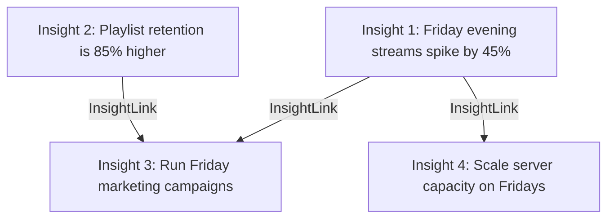

# Lineage Map

The **Lineage Map** tracks relationships and dependencies between different insights, showing how raw data observations lead to tactical business decisions.

---

## The Lineage Model

Relationships are stored in the PostgreSQL database using a self-referencing many-to-many link table `app.insight_links`:
- **`parent_id`**: Reference to the originating insight (e.g. a statistical observation).
- **`child_id`**: Reference to the downstream derived insight (e.g. a recommended business action).

This allows the UI to build a directed acyclic graph (DAG) representing the step-by-step reasoning tree.

---

## Lineage Auditing

Tracking relationships between insights ensures that:
- **Decision Grounding**: Every recommended action can be traced backward to the statistical values and CSV files that justify it.
- **Impact Tracing**: If a raw dataset is updated, the team can immediately identify which downstream insights are affected by the changes.
