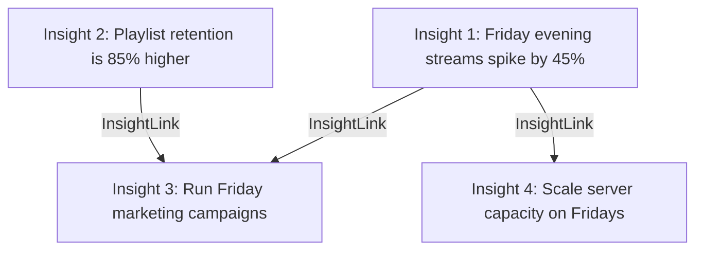
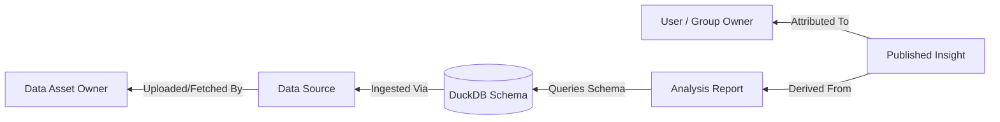

# Lineage Map

The **Lineage Map** tracks relationships and dependencies between different insights, showing how raw data observations lead to tactical business decisions.

---

## The Lineage Model

Relationships are stored in the PostgreSQL database using a self-referencing many-to-many link table `app.insight_links`:
- **`parent_id`**: Reference to the originating insight (e.g. a statistical observation).
- **`child_id`**: Reference to the downstream derived insight (e.g. a recommended business action).

This allows the UI to build a directed acyclic graph (DAG) representing the step-by-step reasoning tree.

---

## Lineage Auditing & Troubleshooting

For analysts and system troubleshooters, the **Lineage Map** serves as an interactive debugging path. If an insight is questioned or a metric discrepancy occurs, you can trace upstream dependencies to pinpoint the exact origin:

### 1. Tracing Upstream Data Origins
To trace where the numbers behind an insight originated:
* **Source Analysis**: Find the parent **[Analysis](../analyses.md)** that generated the insight.
* **DuckDB Table/Schema**: Inside the analysis, check the targeted DuckDB schema (e.g., `s_spotify`, `s_google_sheet`). Data is isolated cleanly to prevent catalog collisions.
* **Ingestion Method**: Check how the data entered the system by linking back to **[Data Ingestion](../data/olap/ingestion.md)**:
  * **Flat Files**: Trace to the staged files (CSV, Parquet, JSON, GPX) and verify their upload hash.
  * **API Ingestion**: Trace to the remote Web Feature Service (WFS) or REST endpoint and review the relational flattening logs.
  * **DLT Pipelines**: Trace to the specific connector (Spotify, Apple Health, LinkedIn, Substack) and inspect the schema evolution rules.

### 2. Identifying Resource & Data Ownership
Governance in Ravioli relies on clear accountability. When investigating an issue, you can trace ownership at two levels:
* **Insight Ownership**: Check the `owner_id` (either an individual **[User](../governance/users.md#role-based-governance)** or a **[User Group](../governance/groups.md)**) of the insight and its parent analysis.
* **Raw Data Ownership**: Trace the underlying dataset in the database to see which team or user uploaded/configured the pipeline (`created_by`/`owner_id` on the dataset).
* **Review/Approval Audit**: Identify the **[Steward or Admin](../governance/users.md#role-based-governance)** who verified the insight to coordinate on potential corrections or overrides.

---

## Impact Analysis (Downstream Tracing)

The upstream linkage also allows for proactive downstream impact tracing:
* **Stale/Updated Data**: If a raw dataset is refreshed or found to contain errors, you can trace downstream nodes along the DAG to see which published insights and decisions are affected.
* **Deprecation Warnings**: Mark a parent node as stale to automatically flag all child insights.
