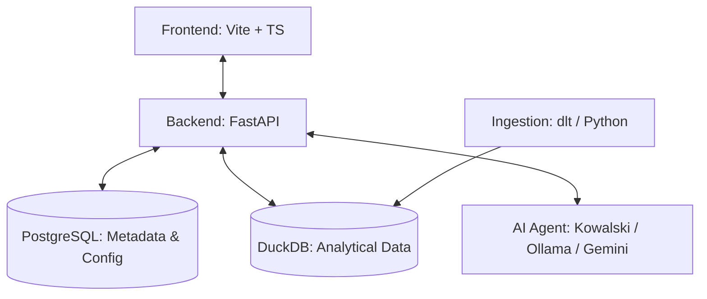

# Introduction to Ravioli

Welcome to the **Ravioli** documentation site! 

Ravioli is a modern, AI-Native, privacy-respecting personal data warehouse and "Vibe-Analytics" platform built for agile teams and individuals. Part of the **AI Passione** ecosystem, Ravioli combines professional-grade data engineering with an interactive notebook interface, running fully local on **DuckDB** with seamless integrations to **MotherDuck**, **Ollama**, and **Notion**.

---

## Core Pillars & Documentation Guide

Explore the architectural components and features of the Ravioli platform:

### 📊 [Insights](./insights.md)
Learn about the formal review lifecycle of analytical facts. Trace observed data points to final team conclusions using the:
- **[Feed & Summary](./insights/feed-summary.md)**: Chronological aggregation feed of verified platform findings.
- **[Lineage Map](./insights/lineage-map.md)**: Relational directed graph showing parent-child insight links.

### 📈 [Analyses](./analyses.md)
Explore the interactive playgrounds where data exploration occurs:
- **[Quick Insights](./analyses/quick-insights.md)**: Instant statistical profiling generated automatically on data upload.
- **[Custom Notebooks](./analyses/custom-notebooks.md)**: Cell-based execution journals saving queries and rendering outputs via SSE streaming.
- **[Deep Dives](./analyses/deep-dives.md) (Upcoming)**: AI-driven autonomous query corrections and dynamic visualization chart layouts.

### 📓 [Knowledge Base](./knowledge.md)
Manage company-specific context definitions to ground AI analysts and prevent hallucinations. Learn how pages are stored as Notion-style block lists and sync bi-directionally.

### 💾 [Data](./data.md)
Understand how raw observations are brought into the local warehouse and structured:
- **[Data Ingestion](./data/ingestion.md)**: Pipelines for flat files (CSV, Parquet, JSON, GPX), API endpoints (WFS geospatial layers), and upcoming DLT connectors.
- **[Data Transformation (ECL)](./data/transformation.md)**: The AI-powered Extract, Contextualize, and Load pipeline featuring PII masking and semantic schema inferences.

### 🛡️ [Governance](./governance/insights-review.md)
Maintain absolute integrity over analytical outputs. Read about data ownership, stewardship workflows, and access control models:
- **[Insights Review](./governance/insights-review.md)**: Auditing steps by Admins and Stewards.
- **[Users](./governance/users.md)** & **[Groups](./governance/groups.md)**: User profiles, team group structures, and lineage attribution tags.

### 🔌 [Settings & Integrations](./settings/integrations.md)
Configure user profiles, manage personal prompts, and link external systems:
- **[Basic Settings](./settings/basic-settings.md)**: Contact metadata and customized persona rules.
- **[Integrations](./settings/integrations.md)**: Local/cloud LLMs (Ollama, Gemini), Knowledge tools (Notion, Confluence), and Cloud Warehouses (MotherDuck, BigQuery).
- **[Notion Sync Guide](./settings/notion-sync.md)**: Deep dive into Notion's API block structures and sync intervals.