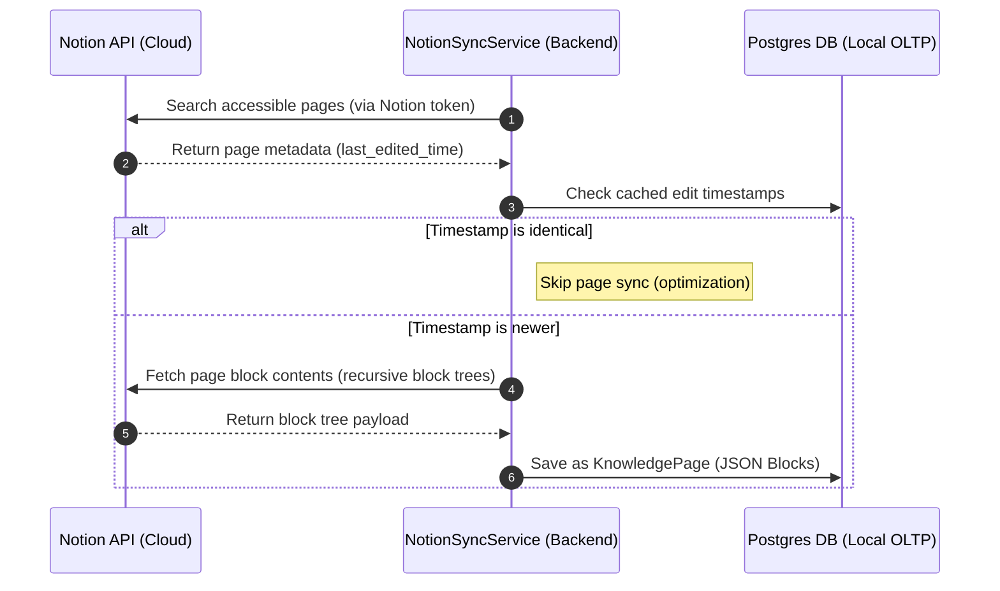
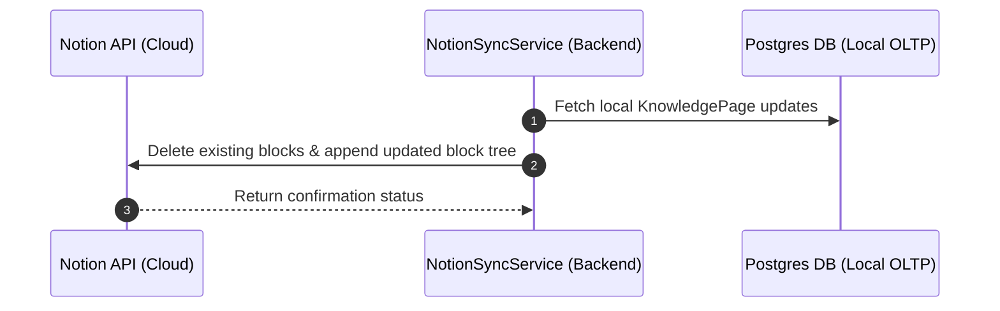

# Notion Sync

Ravioli integrates natively with Notion to synchronize your team's knowledge base, documents, and reference manuals bi-directionally. This keeps your local data dictionaries in sync with live collaborative workspaces.
:::caution Key Consideration: Deletion Guardrails
Ravioli is a data warehouse and AI grounding platform, **not a knowledge management system**. Because the push sync mechanism deletes existing blocks on target Notion pages before appending the updated local layout, you must avoid deleting or purging knowledge pages from within Ravioli unless you explicitly intend to clear the remote Notion page. Always treat Notion as the source of truth for raw document creation and editing.
:::

---

## Technical Details & Constraints

The `NotionSyncService` coordinates communication with the Notion API:

### 1. Import Sync Sequence (Notion -> Ravioli - Pull Flow)

This flow pulls Notion pages down into local PostgreSQL metadata storage:

- **Integration Handshake**: Uses the Notion integration token stored under the `notion` key in `app.system_settings`.
- **Timestamp Caching**: During full or targeted syncs, the remote `last_edited_time` property is compared against the local database's cached timestamp. If no changes have occurred, the import is skipped to reduce API rate-limiting risks.
- **Recursive Block Parsing**: Since Notion documents are constructed from recursive block hierarchies (text paragraphs, lists, headers, callouts), Ravioli parses the block tree recursively, flattening and formatting the content into structured Markdown for Postgres/LLM indexing.

### 2. Export Push Sequence (Ravioli -> Notion - Push Flow)

This flow pushes local edits and generated document components back up to Notion pages:

- **Block Replacement**: Notion's public API does not support full-page HTML/Markdown overwrites. Therefore, to push local edits back to Notion, the synchronization service issues a delete call for all existing child blocks on the Notion page, then appends the updated block tree.
- **Notion Batching Limit**: The Notion API permits appending a maximum of **100 blocks per request**. The export push handles this constraint automatically by segmenting larger documents into chunks of 100 blocks, executing sequential append operations to prevent timeouts and API rejections.

---

## Technical API Endpoints

The frontend settings interface communicates with these transactional endpoints:

- **Pull Notion Sync**: `POST /api/v1/knowledge/notion/sync`  
  Triggered via the **Pull from Notion** UI button. Requests the Notion API to scan, parse, and synchronize all accessible pages. Can optionally accept a list of `page_ids` in the request body to sync specific pages.
- **Push Notion Sync**: `POST /api/v1/knowledge/notion/push`  
  Triggered via the **Push to Notion** UI button. Scans local changes and pushes the updated block hierarchy back to remote Notion pages. Can optionally accept a list of `page_ids` to push specific pages.
