# Notion Sync

Ravioli integrates natively with Notion to synchronize your team's knowledge bases and documents bi-directionally.

```mermaid
sequenceDiagram
    participant Notion as Notion API
    participant Sync as NotionSyncService
    participant DB as Postgres DB
    
    rect rgb(30, 41, 59)
    note right of Sync: Import Sync (Notion -> Ravioli)
    Sync->>Notion: Search accessible pages
    Notion-->>Sync: Return page metadata (last_edited_time)
    Sync->>DB: Check cached edit timestamps
    Sync->>Notion: Fetch page block contents
    Notion-->>Sync: Return block tree
    Sync->>DB: Save as KnowledgePage (JSON Blocks)
    end
    
    rect rgb(30, 41, 59)
    note right of Sync: Export Push (Ravioli -> Notion)
    Sync->>DB: Fetch local updates
    Sync->>Notion: Clear remote blocks & append updated block tree
    Notion-->>Sync: Return confirm status
    end
```

---

## Technical Details

### 1. Import Sync (`Notion -> Ravioli`)
The `NotionSyncService` queries the Notion API to retrieve pages shared with the integration:
- **Timestamp Caching**: The system records the remote `last_edited_time` property. If the local version matches this timestamp, the sync skips the page.
- **Block Parsing**: The rich text elements and nested block structures of Notion are parsed recursively and saved in Ravioli's local database as a block tree.

### 2. Export Push (`Ravioli -> Notion`)
When a local Knowledge Page is updated:
- **Overwrite Append**: Since the Notion API does not support full-document overwrites, Ravioli deletes the remote page's block tree and appends the new structure recursively.
- **Batch Processing**: Requests are batched into chunks of 100 blocks to comply with Notion API limits.
