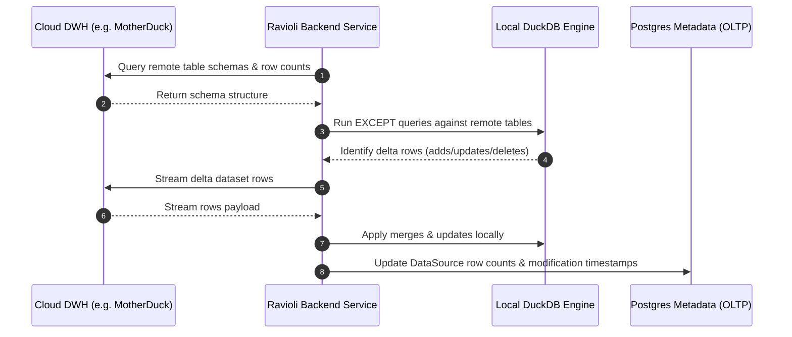
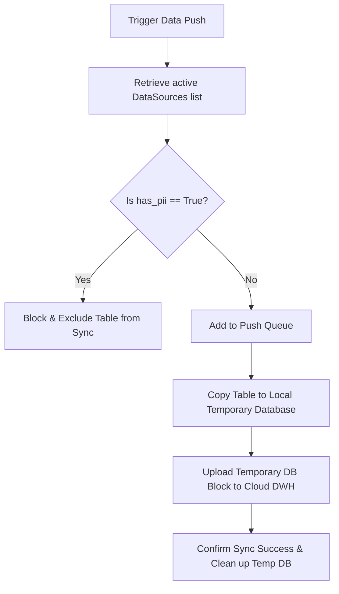

# OLAP Database Integrations

Ravioli is built for fast analytical query execution. It utilizes a hybrid approach, combining zero-latency local execution using **DuckDB** as its default local Data Warehouse (DWH) with cloud data warehouse synchronization.

- **In-process Analytics**: DuckDB executes directly inside the application process as a library, avoiding database server network latency and query parsing overhead.
- **Embedded Storage**: All ingested assets (e.g. flat files, API extracts) are converted into DuckDB tables and written to a local `.db` file within the application directory.
- **Query Engine**: Supports advanced SQL features including Window functions, CTEs, and direct reads of Parquet, CSV, and JSON files.

:::info Data Schema & Performance
For details regarding local DuckDB file structures, schema patterns, and query performance optimizations, see the **[OLAP Database Documentation](../../data/olap.md)**.
:::

---

## Data Versioning & Synchronization (Push/Pull)

To facilitate collaborative workflows and database backups, Ravioli implements a versioned synchronization model to push and pull dataset states between local engines and cloud data warehouses.

### 1. Pulling Data (Cloud -> Local)

Pulling data allows analysts to retrieve the latest version of team datasets from the cloud warehouse down to their local DuckDB instance:
- **Delta Syncing**: Instead of re-downloading entire tables (which incurs high latency and transfer costs), Ravioli compares the local and remote schemas.
- **Difference Set Checks**: It executes SQL queries (using `EXCEPT` clauses) to identify new, modified, or deleted rows, merging only the delta updates into the local database file.
- **Transactional Safety**: Ingested pulls update the transactional metadata in PostgreSQL so that all active analysis interfaces are immediately notified of the new row counts and modification dates.

### 2. Pushing Data (Local -> Cloud) & PII Protection

Pushing data checkpoints local work, uploads derived tables, and publishes curated datasets to the cloud warehouse so they are accessible to the wider team:
- **PII Exclusion Security**: Uploading data to cloud environments presents privacy risks. Ravioli enforces a strict gatekeeping policy based on dataset tagging.
- **The "has_pii" Guardrail**: When a data source is provisioned, Admins or Stewards flag whether the dataset contains Personally Identifiable Information (PII) using the `has_pii` label.
- **Filtering Sequence**: When a bulk push is initiated, the synchronization backend queries the active data sources. Any source flagged with `has_pii = True` is **strictly excluded** from the sync queue, ensuring sensitive customer or corporate data never leaves the local machine.
- **Bulk Push Execution**: Allowed tables are moved into a temporary local database and uploaded to the cloud database in a single block operation to ensure transfer transactional consistency.

### Warehouse Support
This push/pull architecture is natively integrated with **MotherDuck**. It serves as the baseline design for upcoming integrations like **Google BigQuery** to ensure unified data governance and privacy policies across all warehouse integrations.

---

## MotherDuck Cloud Integration (Natively Supported)

Ravioli integrates local DuckDB storage with MotherDuck's cloud data warehouse platform for central sharing and backup.

* **Configuration & Sync**: See the detailed **[MotherDuck Setup Guide](./olap/motherduck.md)** for connection endpoints, safe PII-stripping push mechanics, and syncing rules.

---

## GCP BigQuery (Upcoming)

Support is planned to connect to Google BigQuery, enabling queries on corporate datasets.

* **GCP Credentials**: See the **[BigQuery Guide](./olap/bigquery.md)** for service account credentials and hybrid query capabilities.

