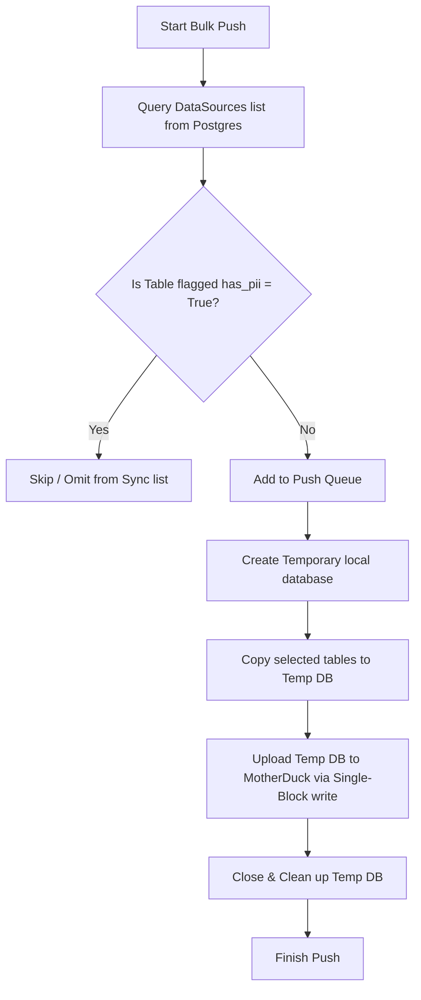

# MotherDuck Cloud Integration

Ravioli integrates local DuckDB storage with **MotherDuck's** cloud data warehouse platform. This enables team-wide sharing, central backups, and collaborative analysis.

---

## Capabilities

### 1. Multi-Database Mounting
When a MotherDuck connection is configured, the backend establishes a connection to `md:` and automatically:
- Creates and mounts a remote cloud database named `ravioli`.
- Keeps the local database mounted side-by-side, allowing queries to join local tables with cloud tables seamlessly.

### 2. Reconnect / Reinitialize Logic
If you modify the MotherDuck API token in the settings:
1. The transactional database is updated with the new encrypted token.
2. The `DuckDBManager` is triggered to perform a dynamic reconnect cycle: it closes all open database connections, tears down the active threadpool, and rebuilds the connection using the updated credentials (`duckdb_manager.reconnect()`).

### 3. Sync Mechanics
Synchronization can flow in both directions:
- **Pull Sync (`MotherDuck -> Local`)**: Pulls missing schemas and table updates from the cloud `ravioli` database down to your local DuckDB engine.
- **Difference Check**: Uses `EXCEPT` SQL clauses to analyze difference sets between the local and cloud tables, syncing only added, updated, or deleted rows rather than re-downloading entire tables.

---

## Safe Bulk Push (PII Stripping)

Uploading enterprise data to a public cloud warehouse requires robust privacy protections. Ravioli implements a strict **Safe Push** protocol to prevent Personally Identifiable Information (PII) leaks.

### Process Flow
1. **PII Filtering**: When initiating a bulk push, the system queries the transactional database for all active `DataSources`. It checks the `has_pii` boolean flag. Any table flagged as containing PII is strictly skipped.
2. **Temporary Database Stage**: To guarantee database block consistency, tables flagged as safe (`has_pii == False`) are copied into a temporary local database.
3. **Single Block Write**: The temporary database is uploaded to MotherDuck in a single block upload operation, minimizing network roundtrips and ensuring transaction boundaries.

---

## Technical API Endpoints

Administrators and Stewards can invoke sync operations and debug states using the backend API:

- **Test Connection**: `GET /api/v1/settings/motherduck/test`  
  Decrypts the stored MotherDuck token and attempts a handshake test (`SELECT 1`) to ensure credentials are valid.
- **Push Action**: `POST /api/v1/settings/motherduck/push`  
  Initiates the PII-filtered safe bulk push sequence.
- **Pull Action**: `POST /api/v1/settings/motherduck/pull`  
  Initiates the database pull synchronization sequence to local DuckDB.
- **Deep Diagnostics**: `GET /api/v1/settings/md-debug`  
  Retrieves comprehensive connection metrics, including active schemas, mounted cloud database names, and a list of synchronized tables within the cloud `ravioli` database.
