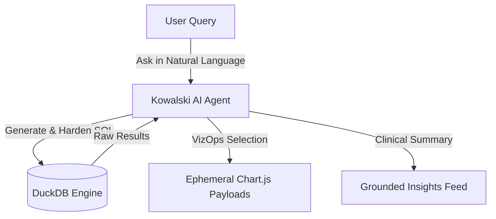

# Vibe Analytics: The Insight-First Paradigm

In modern data organizations, teams spend six figures annually maintaining, rebuilding, and debugging complex, static dashboards. Yet, decision-makers often look at a dashboard and query the data team anyway, asking: *"What is the main takeaway here?"* or *"What is the actual vibe of this data?"*

**Vibe Analytics** represents a fundamental shift in how data is consumed and actioned in the age of AI. Instead of forcing data into rigid, pre-built, and high-maintenance visual grids, Vibe Analytics leverages AI agents like [Kowalski](./kowalski.md) to interpret multi-dimensional data dynamically, generating natural language summaries and context-specific visualizations on demand.

---

## The Dashboard Dilemma

Traditional Business Intelligence (BI) suffers from a structural maintenance trap:

* **High Maintenance Overhead**: Data pipelines break, schemas change, and queries drift. Data teams waste significant resources just keeping dashboards green.
* **Low Consumption Actionability**: Static charts show *what* happened, but fail to explain *why* it happened or *what to do next*.
* **Cognitive Load**: Users must navigate complex filtering UIs and decode multi-layered charts to find a single key takeaway.

---

## Core Pillars of Vibe Analytics

Ravioli's Vibe Analytics framework is built upon three main principles:

### 1. Ephemeral vs. Fixed Visualizations
* **Fixed Dashboards**: Reserved strictly for high-level executive KPIs that require constant, structured monitoring.
* **Ephemeral Analytics**: Interactive charts and query tables are generated by the AI on the fly in response to active questions. They exist to answer a specific, contextual query and do not require ongoing developer maintenance.

### 2. Natural Language Summaries (BLUF)
Vibe Analytics prioritizes **Bottom Line Up Front (BLUF)** reporting. Every data analysis produces a distilled, natural language insight:
* What is the critical trend or anomaly?
* What statistical certainty supports it?
* What action should the business take?

### 3. Open Standards & Dynamic Engines
By leveraging open-source and high-performance analytical engines like **DuckDB**, data processing is kept decoupled from proprietary BI software licenses. AI agents can compile, optimize, and execute SQL statements dynamically, ensuring insights are always freshly generated from source schemas.

---

## How It Works in Ravioli

Ravioli integrates the Vibe Analytics philosophy across three core layers:

1. **[Analyses](./analyses.md)**: The execution environment where users interact with raw data via cells or guided queries.
2. **[AI Analyst (Kowalski)](./kowalski.md)**: The clinical execution engine that autonomously drafts analysis plans, writes DuckDB SQL, parses intent, and selects optimal visualizations.
3. **[Insights](./insights.md)**: The destination feed where reviewed and approved analytical signals are stored and syndicated.

---

## Related Guides

* **[AI Analyst (Kowalski)](./kowalski.md)**: Deep dive into the agent's skills, tools, and persona.
* **[Analyses](./analyses.md)**: Explore the notebooks and workflows where analyses run.
* **[Insights](./insights.md)**: Learn about the curated feed of approved data signals.
