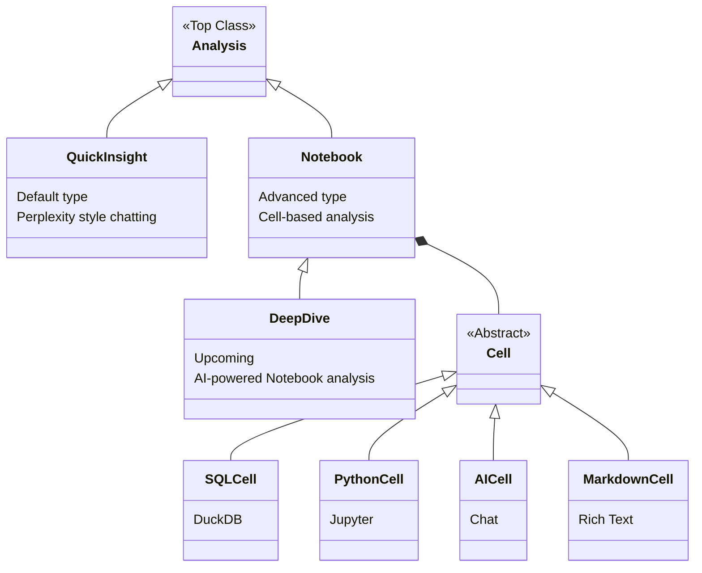

# Analysis Domain Architecture

This document describes the structure and domain modeling of Analyses within Ravioli.

## Core Domain Modeling



1. **Analysis (`Analysis`)**: The top-level class. Represents a structured container for data exploration and insights.
2. **Quick Insight (`quick_insight`)**: The default analysis type. Provides a Perplexity-style chatting experience with data. Users ask questions and get concise, rich-text responses containing insights, tables, and charts.
3. **Notebook (`notebook`)**: A more advanced, professional mode. Uses a cell-based architecture where users can write Python code, execute SQL, chat with AI, and write Markdown documentation. 
4. **Deep Dive (`deep_dive`)**: *(Upcoming)* An AI-driven workflow where the AI drafts an analysis plan upfront, and then populates a full Notebook based on that plan.

## Folder Structure

The code is organized into the following structure:

```text
analysis/
├── AnalysisShell.ts           # Generic wrapper for any Analysis
├── quickinsights/             # Specialized views for Quick Insight
│   ├── QuickInsightInteractions.ts
│   └── QuickInsightView.ts
└── notebook/                  # Specialized views for Notebook
    ├── NotebookInteractions.ts
    ├── NotebookView.ts
    ├── templates.ts           # Shared templates for cells
    └── utils.ts               # Shared utilities
```

## Frontend Component Structure

To support these distinct UX paradigms without duplicating the underlying state management and execution logic, the UI is broken into:

### `AnalysisShell`
The generic wrapper for any Analysis. It provides:
- The top header (Title, Status).
- Attached Context Capsules (Data Sources, Knowledge Pages).
- Owner and Latest Edit date metadata.
- Jupyter Kernel Status indicator.
- Empty State rendering.

### Specialized Views
The shell delegates the rendering of logs (cells/chats) and interactions to specialized views based on `analysis.analysis_metadata?.type`:

- **`quickinsights/QuickInsightView` & `quickinsights/QuickInsightInteractions`**: Renders the logs as conversational chat bubbles and provides a simple, sticky chat input box at the bottom of the screen. Follow-up questions are rendered natively as clickable chips.
- **`notebook/NotebookView` & `notebook/NotebookInteractions`**: Renders the logs as Jupyter-style blocks (`In [*]`, `Out [*]`). Provides floating toolbars and a sticky footer bar for manually injecting Python, SQL, Chat, and Markdown cells.

### Entry Point
`main.ts` observes the `currentView` and `activeId` from `store.ts`. When a user opens an analysis, it determines the type and mounts the `AnalysisShell` initialized with the appropriate specialized view.
